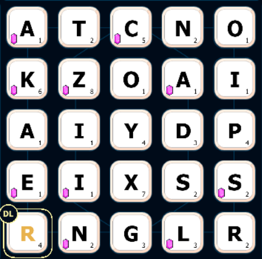
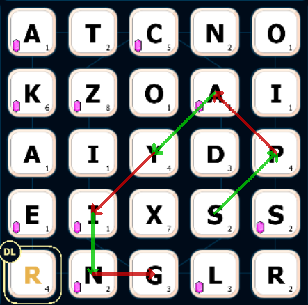

# SpellCast Solver

Identifies best moves for the [SpellCast Discord game](https://beebom.com/how-play-discord-channel-games/). Reads the game state via OCR.

## The game
The goal is to connect letters to make words. You can connect letters horizontally, vertically and diagonally. Each letter used awards points.

Input image             |  Output image
:-------------------------:|:-------------------------:
  |  

## Setup

### Prerequisites:
- [Tesseract](https://github.com/UB-Mannheim/tesseract/wiki) for OCR. Run `sudo apt install tesseract-ocr` for Linux/WSL.
- Python 3.9.12

### Installation:
 `pip install -r requirements.txt`

### Run:
TBD
